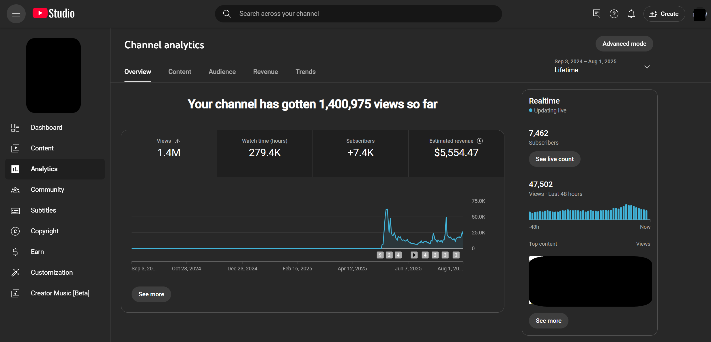
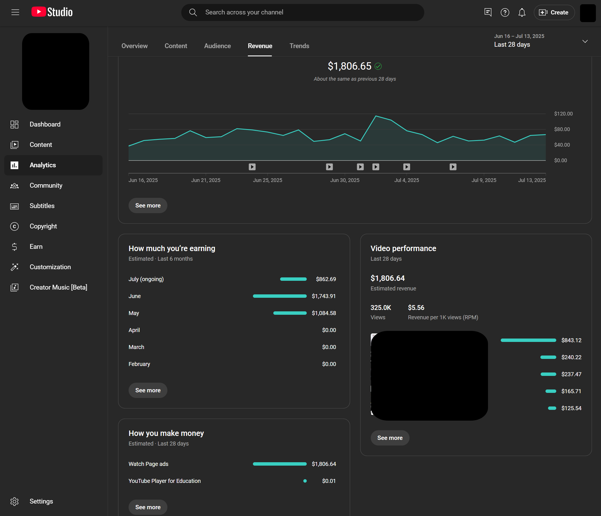

# YouTube Content Creator Setup Guide

A comprehensive setup guide for creators working with Python-based tools, media processing, and ML pipelines.

## Project Results Gallery

<table>
  <tr>
    <td width="50%" align="center">
      
      <br><em>Youtube Studio Statistics (May-July)</em>
    </td>
    <!-- <td width="50%" align="center">
      
      <br><em>Video Processing Pipeline Output</em>
    </td>
  </tr>
  <tr>
    <td width="50%" align="center">
      
      <br><em>ML Model Training Results</em>
    </td> -->
    <!-- <td width="50%" align="center">
      
      <br><em>Final Content Creation Workflow</em>
    </td> -->
  </tr>
</table>

> *These examples showcase the capabilities of the tools and workflows detailed in this setup guide.*

---

## Table of Contents

- [System Requirements](#-system-requirements)
- [Quick Start](#-quick-start)
- [Detailed Installation](#-detailed-installation)
  - [Windows Setup](#-windows-setup)
  - [macOS Setup](#-macos-setup)
  - [Linux Setup](#-linux-setup)
- [Python Environment](#-python-environment)
- [Verification & Testing](#-verification--testing)
- [Common Issues & Solutions](#-common-issues--solutions)
- [Performance Optimization](#-performance-optimization)
- [Hardware Recommendations](#-hardware-recommendations)
- [What's Next](#-whats-next)
- [Maintenance & Updates](#-maintenance--updates)

---

## 💻 System Requirements

### Minimum Requirements
- **OS**: Windows 10+, macOS 10.15+, or Ubuntu 18.04+
- **RAM**: 8GB (16GB recommended for ML workflows)
- **Storage**: 10GB free space for base installation
- **Python**: 3.9+ (3.11.10 recommended)

### Recommended for ML/AI Workflows
- **GPU**: NVIDIA RTX 3060 or better with 8GB+ VRAM
- **RAM**: 32GB for large model processing
- **CPU**: 8+ cores for video processing
- **Storage**: SSD with 50GB+ free space

> ⚠️ **GPU Requirements**: CUDA-compatible NVIDIA GPU required for AI model acceleration. Check [NVIDIA's compatibility list](https://developer.nvidia.com/cuda-gpus) for your specific model.

---

## 🚀 Quick Start

**For experienced users who want to get started immediately:**

1. Install FFmpeg for your platform
2. Create conda environment: `conda create --prefix ./creator_env python==3.11.10`
3. Activate environment: `conda activate ./creator_env`
4. Install dependencies: `pip install -r requirements.txt`
5. Run verification script: `python verify_setup.py`

**Estimated setup time**: 15-30 minutes depending on your internet connection.

---

## 🔧 Detailed Installation

### Windows Setup

#### Step 1: Install Package Manager
We'll use Chocolatey to simplify software installation on Windows.

**Open PowerShell as Administrator** and run:

```powershell
Set-ExecutionPolicy Bypass -Scope Process -Force; `
[System.Net.ServicePointManager]::SecurityProtocol = `
[System.Net.SecurityProtocolType]::Tls12; `
iex ((New-Object System.Net.WebClient).DownloadString('https://chocolatey.org/install.ps1'))
```

**Verify installation:**
```powershell
choco --version
```

#### Step 2: Install FFmpeg
```bash
choco install ffmpeg
```

#### Step 3: Install Git (if not already installed)
```bash
choco install git
```

**Verify installations:**
```bash
ffmpeg -version
git --version
```

---

### macOS Setup

#### Step 1: Install Homebrew
If you don't have Homebrew installed:

```bash
/bin/bash -c "$(curl -fsSL https://raw.githubusercontent.com/Homebrew/install/HEAD/install.sh)"
```

#### Step 2: Install Required Tools
```bash
# Install FFmpeg
brew install ffmpeg

# Install Git (if needed)
brew install git

# Install Python (if using system Python)
brew install python@3.11
```

**Verify installations:**
```bash
ffmpeg -version
git --version
python3.11 --version
```

---

### Linux Setup

#### Step 1: Update Package Manager
```bash
sudo apt update && sudo apt upgrade -y
```

#### Step 2: Install Dependencies
```bash
# Install FFmpeg and essential tools
sudo apt install ffmpeg git python3.11 python3.11-venv python3-pip -y

# For Ubuntu 20.04 or older, you might need:
sudo add-apt-repository ppa:deadsnakes/ppa
sudo apt update
sudo apt install python3.11 python3.11-venv python3.11-dev -y
```

**Verify installations:**
```bash
ffmpeg -version
git --version
python3.11 --version
```

---

## Python Environment

### Why Use Conda?
Conda provides better dependency management and isolated environments, especially important for ML workflows with complex package requirements.

#### Step 1: Install Miniconda
**Download and install from**: [https://docs.conda.io/en/latest/miniconda.html](https://docs.conda.io/en/latest/miniconda.html)

#### Step 2: Create Project Environment
```bash
# Create environment with specific Python version
conda create --prefix ./creator_env python==3.11.10

# Alternative: Create named environment
# conda create --name youtube-creator python==3.11.10
```

#### Step 3: Activate Environment
```bash
# For prefix-based environment
conda activate ./creator_env

# For named environment
# conda activate youtube-creator
```

#### Step 4: Install Python Dependencies
```bash
# Upgrade pip first
pip install --upgrade pip

# Install all required packages
pip install -r requirements.txt
```

### Alternative: Using venv (Built-in)
If you prefer not to use Conda:

```bash
# Create virtual environment
python3.11 -m venv creator_env

# Activate (Windows)
creator_env\Scripts\activate

# Activate (macOS/Linux)
source creator_env/bin/activate

# Install dependencies
pip install -r requirements.txt
```

---

## ✅ Verification & Testing

### Step 1: Create Verification Script
Create a file called `verify_setup.py`:

```python
#!/usr/bin/env python3
"""
Verification script for YouTube Creator setup
"""
import subprocess
import sys

def check_command(command, name):
    try:
        result = subprocess.run(command, capture_output=True, text=True, shell=True)
        if result.returncode == 0:
            print(f"✅ {name}: OK")
            return True
        else:
            print(f"❌ {name}: FAILED")
            return False
    except Exception as e:
        print(f"❌ {name}: ERROR - {e}")
        return False

def check_python_packages():
    packages = [
        'torch', 'torchvision', 'transformers', 
        'diffusers', 'opencv-python', 'numpy'
    ]
    
    failed_packages = []
    for package in packages:
        try:
            __import__(package.replace('-', '_'))
            print(f"✅ {package}: OK")
        except ImportError:
            print(f"❌ {package}: NOT FOUND")
            failed_packages.append(package)
    
    return len(failed_packages) == 0

if __name__ == "__main__":
    print("🔍 Verifying YouTube Creator Setup...\n")
    
    # Check system tools
    checks = [
        ("python --version", "Python"),
        ("ffmpeg -version", "FFmpeg"),
        ("git --version", "Git"),
    ]
    
    all_good = True
    for command, name in checks:
        if not check_command(command, name):
            all_good = False
    
    print("\n📦 Checking Python packages...")
    if not check_python_packages():
        all_good = False
    
    if all_good:
        print("\n🎉 All checks passed! Your setup is ready.")
    else:
        print("\n⚠️  Some checks failed. Please review the installation steps.")
        sys.exit(1)
```

### Step 2: Run Verification
```bash
python verify_setup.py
```

---

## Common Issues & Solutions

### Issue 1: CUDA Out of Memory

**Error:**
```
torch.OutOfMemoryError: CUDA out of memory. Tried to allocate 72.00 MiB...
```

**Solutions:**
1. **Enable expandable memory segments** (requires up-to-date PyTorch and CUDA):
   ```bash
   # Windows
   set PYTORCH_CUDA_ALLOC_CONF=expandable_segments:True
   
   # macOS/Linux
   export PYTORCH_CUDA_ALLOC_CONF=expandable_segments:True
   ```

2. **Reduce batch size** in your scripts
3. **Clear GPU cache** in your Python code:
   ```python
   import torch
   torch.cuda.empty_cache()
   ```

**Reference**: [Stack Overflow - CUDA OOM Solutions](https://stackoverflow.com/questions/73747731/runtimeerror-cuda-out-of-memory-how-can-i-set-max-split-size-mb)

### Issue 2: Diffusers Library Errors

**Common errors with model loading, pipeline initialization, or version conflicts.**

**Solutions:**
1. Update to latest version:
   ```bash
   pip install --upgrade diffusers transformers accelerate
   ```

2. Check model compatibility
3. Clear Hugging Face cache:
   ```bash
   # Windows
   rmdir /s "%USERPROFILE%\.cache\huggingface"
   
   # macOS/Linux
   rm -rf ~/.cache/huggingface
   ```

**Reference**: [Hugging Face - Diffusers Issue #4649](https://github.com/huggingface/diffusers/issues/4649)

### Issue 3: FFmpeg Not Found

**Error:**
```
FileNotFoundError: [Errno 2] No such file or directory: 'ffmpeg'
```

**Solutions:**
1. **Verify PATH**: Restart terminal after installation
2. **Manual installation**: Download from [ffmpeg.org](https://ffmpeg.org/download.html)
3. **Alternative package managers**:
   ```bash
   # Windows (if Chocolatey fails)
   winget install FFmpeg
   
   # macOS (if Homebrew fails)
   port install ffmpeg
   ```

### Issue 4: Permission Errors

**Solutions:**
1. **Run as administrator** (Windows) or use `sudo` (macOS/Linux)
2. **Check file permissions** on your project directory
3. **Use virtual environments** to avoid system-wide installations

### Issue 5: Python Version Conflicts

**Solutions:**
1. **Use pyenv** for Python version management
2. **Specify Python version** explicitly:
   ```bash
   python3.11 -m pip install package_name
   ```
3. **Rebuild environment** if conflicts persist

---

## ⚡ Performance Optimization

### GPU Optimization
- **Monitor GPU usage**: Use `nvidia-smi` to check utilization
- **Optimize batch sizes**: Start small and increase until you hit memory limits
- **Use mixed precision**: Enable FP16 for faster training/inference
- **Pin memory**: Use `pin_memory=True` in PyTorch DataLoaders

### CPU Optimization
- **Set thread counts**: 
  ```python
  import torch
  torch.set_num_threads(8)  # Adjust based on your CPU
  ```
- **Use multiprocessing** for data preprocessing
- **Enable OpenMP**: Set environment variable `OMP_NUM_THREADS`

### Memory Management
- **Monitor RAM usage**: Use task manager or `htop`
- **Clear unused variables**: Use `del variable_name`
- **Use generators** instead of loading all data into memory
- **Configure swap space** (Linux/macOS) for larger datasets

---

## 🖥️ Hardware Recommendations

### Budget Setup ($500-1000)
- **CPU**: AMD Ryzen 5 5600X or Intel i5-12400F
- **GPU**: NVIDIA RTX 3060 (12GB) or RTX 4060
- **RAM**: 16GB DDR4
- **Storage**: 1TB NVMe SSD

### Professional Setup ($1500-3000)
- **CPU**: AMD Ryzen 7 7700X or Intel i7-13700K
- **GPU**: NVIDIA RTX 4070 Ti or RTX 4080
- **RAM**: 32GB DDR4/DDR5
- **Storage**: 2TB NVMe SSD + 4TB HDD

### High-End Setup ($3000+)
- **CPU**: AMD Ryzen 9 7900X or Intel i9-13900K
- **GPU**: NVIDIA RTX 4090 or multiple RTX 4080s
- **RAM**: 64GB DDR5
- **Storage**: 4TB NVMe SSD + 8TB HDD

### Cloud Alternatives
- **Google Colab Pro**: $10/month, good for experimentation
- **AWS EC2 with GPU**: Pay-per-use, scalable
- **Paperspace Gradient**: Specialized for ML workflows
- **RunPod**: Cost-effective GPU cloud computing

---

## What's Next

### Recommended Tutorials
1. **Basic Video Processing**: Learn FFmpeg fundamentals
2. **AI Model Fine-tuning**: Customize models for your content
3. **Automated Workflows**: Build processing pipelines
4. **Content Analysis**: Use ML for audience insights

### Useful Tools to Explore
- **Whisper**: AI-powered transcription
- **Stable Diffusion**: AI image generation
- **ComfyUI**: Node-based AI workflow builder
- **DaVinci Resolve**: Professional video editing
- **OBS Studio**: Live streaming and recording

### Community Resources
- **Discord Servers**: Join creator-focused AI communities
- **GitHub Repositories**: Explore open-source creator tools
- **YouTube Channels**: Follow AI/ML tutorial creators
- **Reddit Communities**: r/MachineLearning, r/StableDiffusion

---

## Maintenance & Updates

### Regular Maintenance Tasks

#### Weekly
- **Update Python packages**:
  ```bash
  pip list --outdated
  pip install --upgrade package_name
  ```

#### Monthly
- **Update system packages**:
  ```bash
  # Windows
  choco upgrade all
  
  # macOS
  brew update && brew upgrade
  
  # Linux
  sudo apt update && sudo apt upgrade
  ```

- **Clean cache files**:
  ```bash
  # Python cache
  find . -type d -name "__pycache__" -delete
  
  # Pip cache
  pip cache purge
  ```

#### As Needed
- **Backup your environment**:
  ```bash
  pip freeze > requirements_backup.txt
  conda env export > environment_backup.yml
  ```

- **Update requirements.txt**:
  ```bash
  pip freeze > requirements.txt
  ```

### Uninstallation

#### Remove Conda Environment
```bash
conda deactivate
conda env remove --prefix ./creator_env
```

#### Remove System Packages
```bash
# Windows
choco uninstall ffmpeg

# macOS
brew uninstall ffmpeg

# Linux
sudo apt remove ffmpeg
```

---

### Useful Links
- [FFmpeg Documentation](https://ffmpeg.org/documentation.html)
- [PyTorch Installation Guide](https://pytorch.org/get-started/locally/)
- [Hugging Face Documentation](https://huggingface.co/docs)
- [CUDA Installation Guide](https://docs.nvidia.com/cuda/cuda-installation-guide-microsoft-windows/)

---

**Last Updated**: 08/03/25 
**Version**: 2.0  
**Maintainer**: Walid Khan